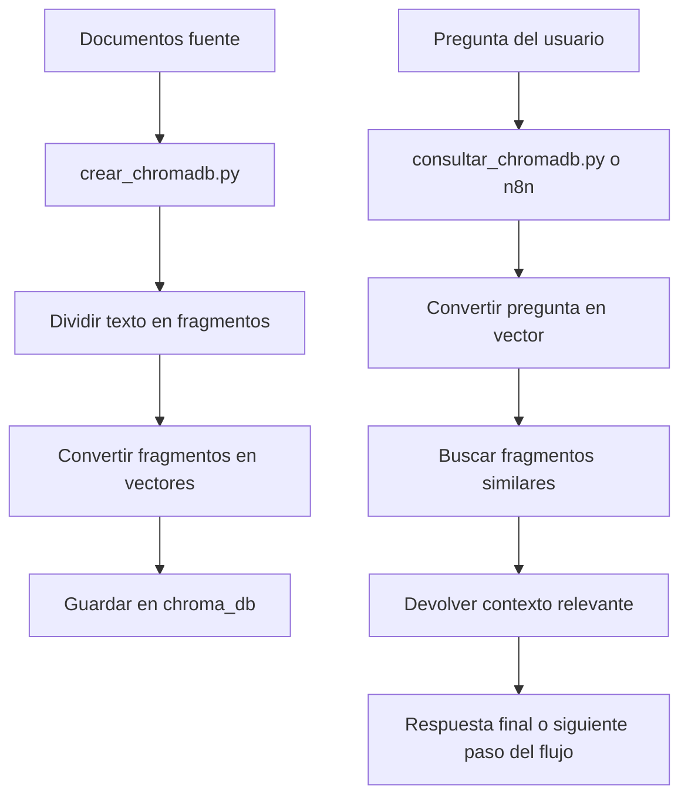
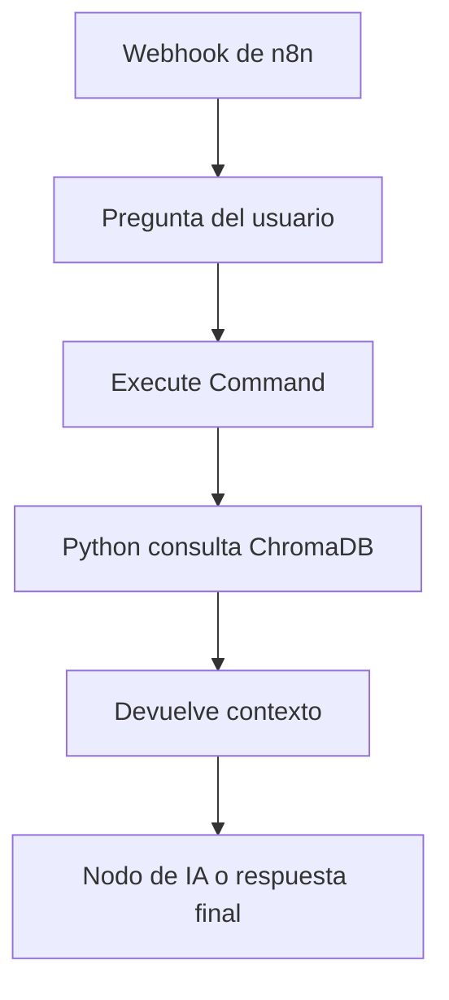
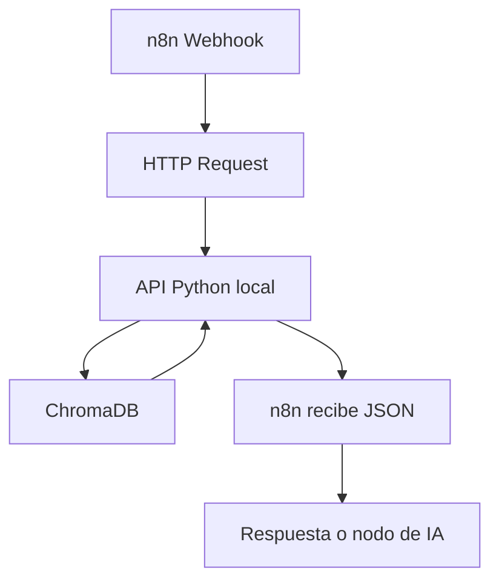
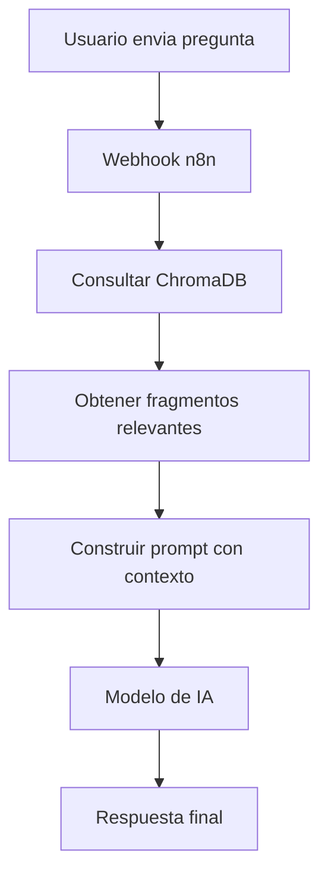

# Documentacion completa: ChromaDB y uso con n8n

Este documento explica que es ChromaDB, como funciona dentro de este proyecto y como se puede conectar con n8n para crear flujos de consulta inteligentes.

El objetivo es que cualquier companero pueda entender:

- Que problema resuelve ChromaDB.
- Como se crea la base vectorial.
- Que archivos del proyecto participan.
- Como consultar la base.
- Como usarla desde n8n.
- Que se debe compartir por GitHub o por otro medio.
- Que errores comunes se deben evitar.

---

## 1. Que es ChromaDB

ChromaDB es una base de datos vectorial.

Una base de datos tradicional guarda informacion en tablas, filas y columnas. Por ejemplo, PostgreSQL puede guardar productos, clientes, ventas o categorias.

Una base de datos vectorial guarda informacion convertida en vectores numericos. Esos vectores representan el significado aproximado de textos, documentos, preguntas o fragmentos de informacion.

En palabras simples:

- Un texto normal es algo como: "Como crear una tabla de productos en PostgreSQL".
- ChromaDB convierte ese texto en una lista de numeros.
- Esa lista de numeros intenta representar el significado del texto.
- Luego, cuando alguien hace una pregunta, ChromaDB tambien convierte la pregunta en numeros.
- Despues compara la pregunta contra los textos guardados.
- Finalmente devuelve los fragmentos mas parecidos.

Esto sirve para crear sistemas de busqueda inteligente o asistentes que respondan usando documentos propios.

---

## 2. Para que sirve en este proyecto

En este proyecto, ChromaDB se usa para guardar informacion relacionada con una base de datos de una tienda de tecnologia.

Los archivos fuente principales son:

- `Guia_Base_Datos_Tienda_Tecnologia.md`
- `tienda_tecnologia_postgresql.sql`

El script `crear_chromadb.py` toma esos archivos, divide su contenido en fragmentos y los guarda en ChromaDB.

Luego, el script `consultar_chromadb.py` permite hacer preguntas y recuperar los fragmentos mas relevantes.

Ejemplo de pregunta:

```text
Como se crea la tabla de productos?
```

ChromaDB buscara dentro de los documentos guardados y devolvera los fragmentos que tengan mayor relacion con esa pregunta.

---

## 3. Archivos importantes del proyecto

La estructura relevante del proyecto es:

```text
Base de Datos IA/
  crear_chromadb.py
  consultar_chromadb.py
  requirements.txt
  Guia_Base_Datos_Tienda_Tecnologia.md
  tienda_tecnologia_postgresql.sql
  chroma_db/
```

### `crear_chromadb.py`

Este archivo crea la base vectorial.

Hace lo siguiente:

1. Define la carpeta donde se guardara ChromaDB.
2. Define el nombre de la coleccion.
3. Lee los documentos fuente.
4. Divide los documentos en fragmentos pequenos.
5. Convierte cada fragmento en un vector.
6. Guarda los fragmentos, vectores y metadatos en ChromaDB.

En este proyecto usa:

```python
DB_DIR = BASE_DIR / "chroma_db"
COLLECTION_NAME = "tienda_tecnologia"
```

Eso significa que la base se guarda en la carpeta:

```text
chroma_db/
```

y la coleccion se llama:

```text
tienda_tecnologia
```

### `consultar_chromadb.py`

Este archivo consulta la base vectorial.

Hace lo siguiente:

1. Pide una pregunta por consola.
2. Abre la base ChromaDB guardada en `chroma_db`.
3. Abre la coleccion `tienda_tecnologia`.
4. Convierte la pregunta en vector.
5. Busca los 3 fragmentos mas parecidos.
6. Muestra los resultados en pantalla.

### `requirements.txt`

Este archivo contiene las dependencias necesarias.

Actualmente tiene:

```text
chromadb
```

Eso significa que para usar el proyecto se debe instalar ChromaDB con:

```powershell
pip install -r requirements.txt
```

---

## 4. Como funciona el proceso completo

El flujo general es este:



---

## 5. Que es una coleccion en ChromaDB

Una coleccion es como una tabla dentro de ChromaDB.

En este proyecto la coleccion se llama:

```text
tienda_tecnologia
```

Dentro de esa coleccion se guardan muchos fragmentos.

Cada fragmento tiene:

- Un `id`.
- El texto del fragmento.
- Su vector.
- Metadatos.

Ejemplo conceptual:

```text
ID: Guia_Base_Datos_Tienda_Tecnologia_1
Documento: "La base de datos de tienda tecnologia contiene..."
Metadata:
  archivo: Guia_Base_Datos_Tienda_Tecnologia.md
  fragmento: 1
Vector:
  [0.12, -0.03, 0.00, ...]
```

Los metadatos permiten saber de donde salio cada respuesta.

En este proyecto se guardan estos metadatos:

```python
{
    "archivo": source.name,
    "fragmento": index,
}
```

Eso ayuda a identificar si el resultado vino del archivo Markdown o del SQL.

---

## 6. Que son los embeddings

Un embedding es una representacion numerica de un texto.

Ejemplo muy simplificado:

```text
"producto tecnologia laptop" -> [0.23, -0.10, 0.55, ...]
"computadora portatil"       -> [0.21, -0.08, 0.50, ...]
```

Aunque los textos no sean iguales, sus vectores pueden quedar cerca porque significan algo parecido.

ChromaDB usa esos vectores para buscar similitud.

---

## 7. Importante: el embedding de este proyecto es local

Este proyecto no usa OpenAI, Gemini ni otro modelo externo para crear embeddings.

Usa una clase propia llamada:

```python
LocalHashEmbeddingFunction
```

Esta funcion convierte palabras en numeros usando hashes.

Ventajas:

- No necesita internet.
- No necesita API key.
- Es facil de compartir.
- Funciona en cualquier computador con Python y ChromaDB instalado.

Limitaciones:

- No entiende el significado tan bien como un modelo real de embeddings.
- Puede fallar con sinonimos o preguntas muy distintas al texto original.
- Es util para proyectos academicos o pruebas, pero no es la mejor opcion para produccion.

Punto clave:

La misma funcion de embedding debe usarse al crear y al consultar la base.

Por eso `crear_chromadb.py` y `consultar_chromadb.py` tienen la misma clase `LocalHashEmbeddingFunction`.

Si una persona crea la base con un embedding y otra consulta con un embedding diferente, los resultados pueden salir mal o ChromaDB puede generar errores por dimensiones incompatibles.

---

## 8. Como crear la base ChromaDB

Desde la carpeta del proyecto:

```powershell
cd "C:\Users\Anthony\Documents\Base de Datos IA"
```

Instalar dependencias:

```powershell
pip install -r requirements.txt
```

Crear la base:

```powershell
python crear_chromadb.py
```

Si todo sale bien, deberia aparecer algo parecido a:

```text
Base ChromaDB creada en: C:\Users\Anthony\Documents\Base de Datos IA\chroma_db
Coleccion: tienda_tecnologia
Fragmentos guardados: X
```

Despues de ejecutar ese comando, se crea la carpeta:

```text
chroma_db/
```

Esa carpeta es la base persistente de ChromaDB.

---

## 9. Como consultar la base desde Python

Ejecutar:

```powershell
python consultar_chromadb.py
```

Luego escribir una pregunta, por ejemplo:

```text
Pregunta: Como se crean las tablas principales?
```

El script devolvera los 3 resultados mas relevantes:

```text
Resultados mas relevantes:

--- Resultado 1 ---
Archivo: tienda_tecnologia_postgresql.sql | Fragmento: 2
...
```

Esto confirma que la base vectorial funciona antes de conectarla con n8n.

---

## 10. Que se debe compartir con los companeros

Hay dos formas de compartir el proyecto.

### Opcion A: Compartir la base ChromaDB ya creada

Se comparte la carpeta completa:

```text
chroma_db/
```

No basta con compartir solo `chroma.sqlite3`, porque ChromaDB puede guardar mas archivos y carpetas internas.

Se debe compartir:

```text
crear_chromadb.py
consultar_chromadb.py
requirements.txt
Guia_Base_Datos_Tienda_Tecnologia.md
tienda_tecnologia_postgresql.sql
chroma_db/
```

Ventaja:

- Los companeros no tienen que recrear la base.

Desventaja:

- La carpeta puede pesar mucho.
- GitHub no es ideal para bases vectoriales grandes.

### Opcion B: Compartir los documentos y el script para que cada uno regenere ChromaDB

Se comparte:

```text
crear_chromadb.py
consultar_chromadb.py
requirements.txt
Guia_Base_Datos_Tienda_Tecnologia.md
tienda_tecnologia_postgresql.sql
```

Cada companero ejecuta:

```powershell
pip install -r requirements.txt
python crear_chromadb.py
```

Ventaja:

- El repositorio queda mas limpio.
- No se suben archivos generados.
- Es mas facil actualizar la base si cambian los documentos.

Desventaja:

- Cada companero debe ejecutar el script antes de usar n8n.

Recomendacion para este proyecto:

Para un proyecto academico pequeno, se puede subir `chroma_db/` si no pesa demasiado.

Para un proyecto mas ordenado, es mejor subir los documentos y scripts, y que cada companero regenere la base localmente.

---

## 11. Como usar ChromaDB con n8n

n8n puede conectarse con ChromaDB de varias maneras. La mejor opcion depende de como este instalado n8n.

Escenarios comunes:

1. n8n instalado localmente en la misma computadora.
2. n8n corriendo con Docker.
3. n8n en la nube.

Cada caso cambia la forma de acceder a la carpeta `chroma_db`.

---

## 12. Opcion simple: n8n ejecuta un script de Python

Esta es la opcion mas facil para este proyecto.

La idea es:

1. n8n recibe una pregunta.
2. n8n ejecuta un script de Python.
3. Python consulta ChromaDB.
4. Python devuelve los fragmentos relevantes.
5. n8n usa esos fragmentos para responder o continuar el flujo.

Flujo:



### Paso 1: Crear un script consultable por parametros

El archivo actual `consultar_chromadb.py` pide la pregunta con `input()`.

Para n8n conviene tener un script que reciba la pregunta como argumento.

Ejemplo conceptual:

```powershell
python consultar_chromadb_n8n.py "Como se crea la tabla productos?"
```

Ese script deberia devolver una respuesta limpia, idealmente en JSON.

Ejemplo de salida:

```json
{
  "pregunta": "Como se crea la tabla productos?",
  "resultados": [
    {
      "archivo": "tienda_tecnologia_postgresql.sql",
      "fragmento": 3,
      "texto": "CREATE TABLE productos..."
    }
  ]
}
```

JSON es recomendable porque n8n lo puede leer y usar facilmente.

### Paso 2: Crear un workflow en n8n

Un flujo basico puede tener estos nodos:

```text
Webhook -> Execute Command -> Parse JSON -> Respond to Webhook
```

### Paso 3: Configurar Webhook

El Webhook recibe una pregunta.

Ejemplo de body:

```json
{
  "pregunta": "Como se crea la tabla productos?"
}
```

### Paso 4: Configurar Execute Command

El nodo Execute Command ejecutaria algo parecido a:

```powershell
python "C:\Users\Anthony\Documents\Base de Datos IA\consultar_chromadb_n8n.py" "{{$json.body.pregunta}}"
```

Si n8n esta en Linux o Docker, la ruta sera distinta.

Ejemplo Linux/Docker:

```bash
python /data/BaseDeDatosIA/consultar_chromadb_n8n.py "{{$json.body.pregunta}}"
```

### Paso 5: Parsear respuesta

Si Python devuelve JSON, n8n puede convertir esa salida en datos estructurados y usarlos en otros nodos.

---

## 13. Opcion recomendada para integracion limpia: crear una API local

Una alternativa mas ordenada es crear una pequena API con Python.

La idea:

1. Python mantiene un endpoint HTTP.
2. n8n llama ese endpoint con HTTP Request.
3. La API consulta ChromaDB.
4. La API responde JSON.

Flujo:



Ejemplo de endpoint:

```text
POST http://localhost:8000/consultar
```

Body:

```json
{
  "pregunta": "Que tablas existen en la base de datos?"
}
```

Respuesta:

```json
{
  "resultados": [
    {
      "archivo": "tienda_tecnologia_postgresql.sql",
      "fragmento": 1,
      "texto": "..."
    }
  ]
}
```

Ventajas de esta opcion:

- n8n no necesita ejecutar comandos del sistema.
- Es mas facil de probar.
- Se puede usar desde varios flujos.
- Es mas parecido a una arquitectura real.

Desventajas:

- Hay que mantener la API encendida.
- Requiere instalar una libreria como FastAPI o Flask.

---

## 14. Opcion con nodos de IA de n8n

n8n tambien puede trabajar con flujos de IA, agentes y bases vectoriales dependiendo de los nodos disponibles en la instalacion.

En ese caso, el flujo conceptual seria:

```text
Pregunta del usuario
-> Buscar contexto en ChromaDB
-> Enviar pregunta + contexto al modelo
-> Generar respuesta
```

El prompt al modelo podria ser:

```text
Responde usando solo el siguiente contexto.
Si el contexto no contiene la respuesta, di que no tienes informacion suficiente.

Pregunta:
{{$json.pregunta}}

Contexto:
{{$json.contexto}}
```

Esta tecnica se llama RAG.

RAG significa Retrieval Augmented Generation, o generacion aumentada por recuperacion.

En palabras simples:

1. Primero se busca informacion relevante en ChromaDB.
2. Luego esa informacion se le pasa a un modelo de IA.
3. El modelo responde usando ese contexto.

---

## 15. Como seria un flujo RAG completo con n8n

Un flujo completo podria ser:



Ejemplo:

Pregunta:

```text
Que hace la tabla productos?
```

ChromaDB devuelve contexto:

```text
La tabla productos almacena informacion de los productos de la tienda...
```

n8n construye prompt:

```text
Usa este contexto:
La tabla productos almacena informacion de los productos de la tienda...

Pregunta:
Que hace la tabla productos?
```

El modelo responde:

```text
La tabla productos sirve para almacenar los articulos disponibles en la tienda, incluyendo datos como nombre, precio, categoria y stock.
```

---

## 16. Uso con n8n instalado localmente

Si n8n esta instalado directamente en la computadora, debe poder acceder a la carpeta del proyecto.

Ruta de ejemplo:

```text
C:\Users\Anthony\Documents\Base de Datos IA
```

El comando desde n8n podria usar esa ruta completa.

Ejemplo:

```powershell
python "C:\Users\Anthony\Documents\Base de Datos IA\consultar_chromadb_n8n.py" "{{$json.body.pregunta}}"
```

Puntos importantes:

- Python debe estar instalado.
- ChromaDB debe estar instalado en el mismo entorno donde n8n ejecuta el comando.
- La ruta debe existir.
- La carpeta `chroma_db` debe estar creada.

---

## 17. Uso con n8n en Docker

Si n8n corre en Docker, el contenedor no ve automaticamente los archivos de Windows.

Hay que montar la carpeta del proyecto como volumen.

Ejemplo en `docker-compose.yml`:

```yaml
services:
  n8n:
    image: n8nio/n8n
    ports:
      - "5678:5678"
    volumes:
      - ./n8n_data:/home/node/.n8n
      - ./BaseDeDatosIA:/data/BaseDeDatosIA
```

Dentro de n8n, la ruta ya no seria:

```text
C:\Users\Anthony\Documents\Base de Datos IA
```

Sino:

```text
/data/BaseDeDatosIA
```

Entonces el script se ejecutaria como:

```bash
python /data/BaseDeDatosIA/consultar_chromadb_n8n.py "{{$json.body.pregunta}}"
```

Punto clave:

La ruta que importa es la ruta dentro del contenedor, no la ruta de Windows.

---

## 18. Uso con n8n Cloud

Si n8n esta en la nube, normalmente no puede leer una carpeta local de tu computadora.

En ese caso no sirve apuntar a:

```text
C:\Users\Anthony\Documents\Base de Datos IA\chroma_db
```

porque esa ruta solo existe en tu maquina.

Para n8n Cloud hay mejores opciones:

1. Crear una API publica o accesible por internet que consulte ChromaDB.
2. Usar una base vectorial alojada en un servidor.
3. Usar un servicio externo de vector database.
4. Ejecutar n8n y ChromaDB en el mismo servidor.

Para este proyecto, si se usa n8n Cloud, lo mas practico seria crear una API local y exponerla solo si es necesario, o usar n8n instalado localmente.

---

## 19. GitHub: que subir y que no subir

Se recomienda subir:

```text
crear_chromadb.py
consultar_chromadb.py
requirements.txt
Guia_Base_Datos_Tienda_Tecnologia.md
tienda_tecnologia_postgresql.sql
DOCUMENTACION_CHROMADB_N8N.md
```

Sobre `chroma_db/`:

Se puede subir si:

- Pesa poco.
- El proyecto es academico.
- Todos necesitan exactamente la misma base ya generada.

No conviene subirla si:

- Pesa mucho.
- Cambia constantemente.
- Tiene archivos generados grandes.
- Se puede regenerar facilmente con `crear_chromadb.py`.

Una practica ordenada seria agregar a `.gitignore`:

```gitignore
chroma_db/
```

y explicar en el README:

```powershell
python crear_chromadb.py
```

Asi cada persona genera su propia copia local.

---

## 20. Pasos para un companero que descarga el proyecto

### Si el repositorio incluye `chroma_db/`

1. Clonar el repositorio.

```powershell
git clone URL_DEL_REPOSITORIO
```

2. Entrar a la carpeta.

```powershell
cd "Base de Datos IA"
```

3. Instalar dependencias.

```powershell
pip install -r requirements.txt
```

4. Probar consulta.

```powershell
python consultar_chromadb.py
```

5. Conectar n8n usando la ruta del proyecto.

### Si el repositorio no incluye `chroma_db/`

1. Clonar el repositorio.

```powershell
git clone URL_DEL_REPOSITORIO
```

2. Entrar a la carpeta.

```powershell
cd "Base de Datos IA"
```

3. Instalar dependencias.

```powershell
pip install -r requirements.txt
```

4. Crear la base.

```powershell
python crear_chromadb.py
```

5. Probar consulta.

```powershell
python consultar_chromadb.py
```

6. Conectar n8n.

---

## 21. Errores comunes

### Error: no existe la coleccion

Puede pasar si se intenta consultar antes de crear la base.

Solucion:

```powershell
python crear_chromadb.py
```

### Error: no existe la carpeta `chroma_db`

Significa que todavia no se genero la base o que la ruta esta mal.

Solucion:

- Revisar que se ejecuto `crear_chromadb.py`.
- Revisar que n8n esta apuntando a la ruta correcta.

### Error: n8n no encuentra Python

Puede pasar si el nodo Execute Command no tiene acceso a `python`.

Soluciones:

- Usar la ruta completa de Python.
- Revisar variables de entorno.
- Si n8n esta en Docker, instalar Python dentro del contenedor o usar una API externa.

### Error: ChromaDB no esta instalado

Solucion:

```powershell
pip install chromadb
```

o:

```powershell
pip install -r requirements.txt
```

### Error: funciona en mi computadora pero no en la de mis companeros

Posibles causas:

- No instalaron dependencias.
- No generaron `chroma_db`.
- La ruta en n8n esta mal.
- Estan usando Docker y no montaron el volumen.
- Tienen una version distinta de Python o ChromaDB.

---

## 22. Recomendacion de arquitectura para el proyecto

Para avanzar de forma ordenada, se recomienda esta estructura:

```text
Base de Datos IA/
  crear_chromadb.py
  consultar_chromadb.py
  consultar_chromadb_n8n.py
  api_chromadb.py
  requirements.txt
  Guia_Base_Datos_Tienda_Tecnologia.md
  tienda_tecnologia_postgresql.sql
  DOCUMENTACION_CHROMADB_N8N.md
  README.md
  chroma_db/
```

Para una primera version con n8n:

```text
n8n Webhook -> Execute Command -> consultar_chromadb_n8n.py -> respuesta JSON
```

Para una version mas limpia:

```text
n8n Webhook -> HTTP Request -> API Python -> ChromaDB -> respuesta JSON
```

---

## 23. Informacion que falta definir para dejar la integracion final lista

Para complementar la conexion exacta con n8n, falta saber:

1. Como estan usando n8n:
   - Instalado en Windows.
   - Instalado con Docker.
   - n8n Cloud.

2. Que quieren que haga el flujo:
   - Solo devolver fragmentos encontrados.
   - Responder con IA usando esos fragmentos.
   - Enviar la respuesta por WhatsApp, Telegram, correo u otro canal.

3. Que modelo de IA usaran:
   - OpenAI.
   - Gemini.
   - Ollama local.
   - Otro.

4. Si quieren compartir la carpeta `chroma_db/` ya creada o prefieren que cada companero la genere.

Con esa informacion se puede crear el workflow exacto de n8n y, si hace falta, preparar el script `consultar_chromadb_n8n.py` para que devuelva JSON listo para usar.

---

## 24. Resumen final

ChromaDB permite guardar documentos como vectores para hacer busquedas inteligentes por significado.

En este proyecto:

- Los documentos fuente son la guia Markdown y el archivo SQL.
- `crear_chromadb.py` crea la base vectorial.
- La base se guarda en `chroma_db/`.
- La coleccion se llama `tienda_tecnologia`.
- `consultar_chromadb.py` permite hacer preguntas.
- n8n puede usar ChromaDB ejecutando un script Python o llamando una API.
- Si n8n corre en Docker o en la nube, hay que cuidar muy bien las rutas y el acceso a los archivos.

La forma mas sencilla para comenzar es:

```text
Webhook de n8n -> Execute Command -> script Python -> ChromaDB -> respuesta JSON
```

La forma mas recomendable para un sistema mas ordenado es:

```text
n8n -> HTTP Request -> API Python -> ChromaDB
```

